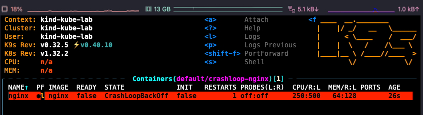
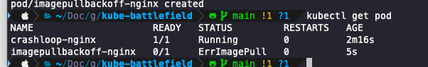
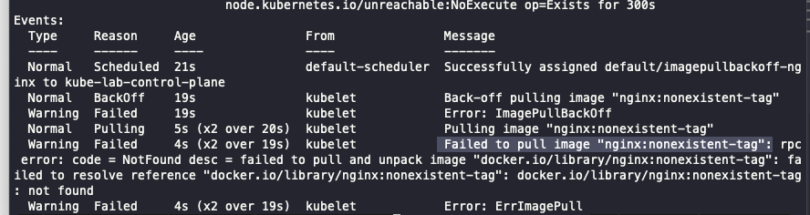

# troubleshoot 실습

## CrashLoopBackOff 실습

### ✅ 증상

- `kubectl get pods` 결과 `CrashLoopBackOff` 상태 확인됨
- 재시작이 계속 반복되고 있음



### 🧨 원인

- 컨테이너 명령(command)이 `exit 1`로 설정되어 바로 종료됨

```yaml
command: ["/bin/sh", "-c", "exit 1"]
```

### 🛠️ 해결 방법

- `sleep infinity` 로 명령어 수정하여 정상적으로 pod가 유지되도록 변경

```yaml
command: ["/bin/sh", "-c", "sleep infinity"]
```

---

## ImagePullBackOff 실습

### ✅ 증상

- Pod 상태: `ImagePullBackOff`

- describe 결과:


### 🧨 원인

- 잘못된 태그 (`nonexistent-tag`)로 인해 Docker Hub에서 이미지를 찾지 못함

### 🛠️ 해결 방법

- 이미지 태그를 `nginx:latest`로 수정 후 재배포